## Supervised Learning - Report
#### Xicheng Huang (xhuang343) - Fall 2018

## Introduction
For this assignment, I picked two completely different datasets in terms of their characteristics for classification problems so that I can learn applying supervised learning algorithms on a more well-rounded way. The first dataset is somewhat a larger dataset where it consists of more than 48000 records. It is a binary classification problem and the features are categorical. The second dataset I picked is a much smaller dataset with only 304 records, and it is also a multi-class problem. For each dataset, I will explain what I did to preprocess them and then go into each of the supervised learning algorithms I applied and their corresponding performance. 
For tools, I primarily used Python's scikit-learn library to perform machine learning tasks and used various libraries, including matplotlib and sklearn-evaluation to graph various performance metrics and results of the applied algorithms. 

## Dataset One
### **Data Preprocessing & Investigation**
The first dataset is from UC Irvine Machine Learning Repository, and it is called Adult data set. This is an extraction from the 1994 Census database and prediction task is to determine whether a person makes over 50K a year. This is interesting because it is being used to look at family income and poverty situations and study what characterstics can improve income and standard of livings. Once I loaded the data with headers and the right delimiter, without any preprocessing, the dataset looks like this:

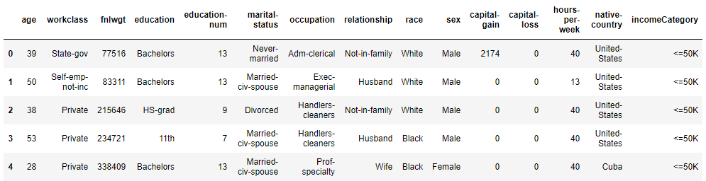

As you can seem the dataset is full of categorical features and the label (incomeCategory) is a string representation as well. Because scikit-learn's classification algorithms will not accept any string represented features, one of the first tasks is to convert them to numerical. I could enumerate the categories for each feature, for example, 0 for "Bachelors" and 1 for "HS-grad" for "education", but scikit-learn will treat them as continuous data, as a result, the models could provide wrong "understanding" of these features. So the solution is one-hot-encode all of them. After encoding, it will add extra columns for each category of each of the feature. For example, row 0 will have education_Bachelors as 1, meaning it indeed has a education of Bachelors for the feature, and everything other columns for education is 0. Also, I converted the labels into 0s and 1s where 0 is "<=50K" and 1 is ">50K". Then, there were also a handful missing data, so I just set them as 0. After preprocessing, the dataset looks like this:

After preprocessing them, I randomly divided the dataset up into thirds, 2/3 will be used for training, and 1/3 will be used to testing. Then, I wanted to check the labels to see if the distribution of classes are even. Here is the result:

 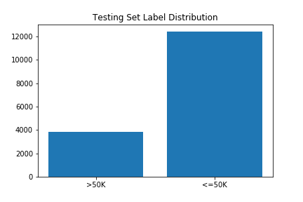

As you can see, there are far more "<=50K" labels in both the training set and testing set. So to make sure the machine learning models are performant, I should not only look at accuracy score but also weighted f1 scores.

### **Decision Tree**
For decision tree classifier, I used scikit-learn's `DecisionTreeClassifier()` to create the model. Without pruning, the tree has more than 9000 nodes! This is very large and definitely susceptible to overfitting. So I used a custom pruning method to prune the tree after modeling. The custom pruning method takes in a threshold parameter and utilize it to check the value of each node and if the smallest value of the node is below that threshold, it will prune it and its children out. Here is a graph representing the benefit of this pruning process:

 

As you can see, without any pruning, the model is overfitting there it is at almost 100% accuracy when predicting training set while it is not doing so hot for testing set. As the pruning threshold increases, predictions for training set and testing set are converaging, and overfitting fades out. The learning curve for the best model created is the following:

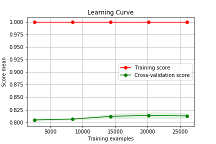

### **Neural Networks**
For this algorithm, I used `MLPClassifier()`, and specifically, I used logistic regression in combination of stochastic gradient descent for activation because according to the lecture, calculus is better. I also incorporated k-fold cross-validation and hyperparameter tunning to try to get the best result from this algorithm. For this, I used `GridSearchCV()` provided by scikit-learn, which I am using for other algorithms as well. The result is this:

Let's look at the learning curve for the best neural network model:

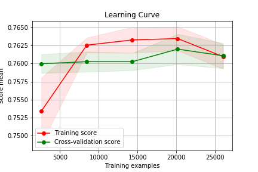

### **Boosting**
Here I am using `GradientBoostingClassifier()` which uses gradient tree boosting, a generalization of boosting to arbitrary differentiable loss functions. There are a number of parameters that I can tune for this classifier, and I am going to focus on the number of estimators, the learning rate, and maximum depth of the gradient decision tree. The graph below shows a fixed learning rate with a variation of numbers of estimators. 

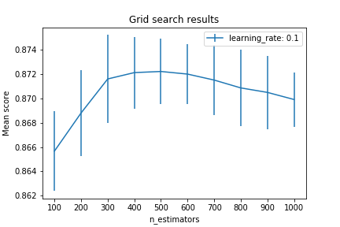

Due to page limitation, I can't show all the hyperparameters tunning graph. From the more cross validation hyperparameters tunning, the best accuracy I could get is using learning rate of 0.1, number of estimators of 900, with a max depth of 6. The learning curve for these parameters is:

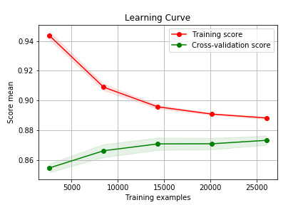

### **KNN**
Again, I am using scikit-learn's KNN algorithm `KNeighborsClassifier()`. For this method, I am tunning number of neighbors, the weights on the neighbors, and a p value which is power parameter for the Minkowski metric. When p is 1, this is equivalent to using manhattan distance, and euclidean_distance for p is 2. For arbitrary p, minkowski distance is used. The first graph I am showing below is using uniform weights for the nearest neighbors. 

After comparisons with several tunning processes, using uniform weight has better results than distance weight. Also, the accuracy increases as the number of neighbors increases. In addition, manhattan distance has better accuray. Now, let's have a constant p value and uniform weight and see if just increasing the number of neighbors will improve the model even more. 

The learning curve for the best model created by KNN is the following:

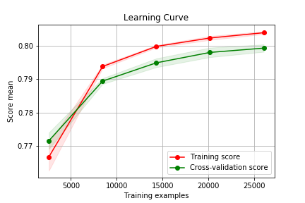

### **Support Vector Machine**
Using scikit-learn's SVM classifier, it is pretty slow to train a model running on my machine. Once I added k-fold cross validation, it doesn't finish at all. According to the documentation, it says that "the fit time complexity is more than quadratic with the number of samples which makes it hard to scale to dataset with more than a couple of 10000 samples." This dataset has more than 48000 training samples, as a result, I couldn't do any k-fold cross validation and parameters tunning because of the extremely long runtime and no convergency. 

The learning curve for a basic model with default parameters is the following:

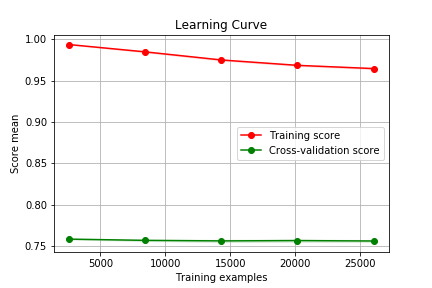

### **Conclusion**
Now I am going to compare weighted precision, recall as well as f1 scores of the best models from each algorithm because they will provide me useful information in selecting classification algorithm for this dataset. Keep in mind that the training set label distribution is imbalanced so that weighted f1 score is a better metric than just simply accuracy of the cross-validation.

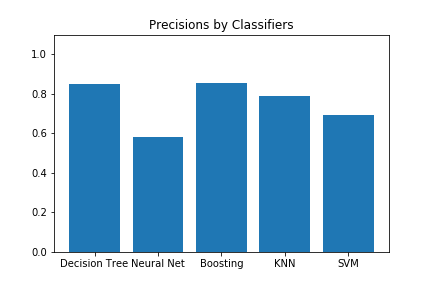 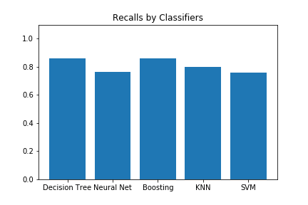 
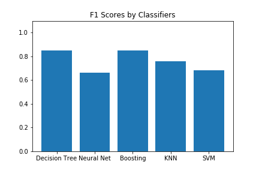

As you can see that boosting and decision tree algorithms are among the better ones. Let's look at the training and running times before making a conclusion.

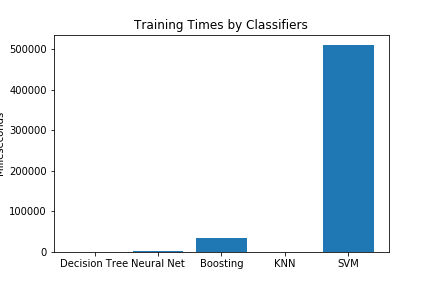 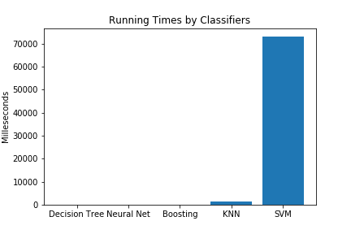

From these two graphs, it shows that SVM algorithm take a significant amount of time to train compare to others. Decision tree models have better training times so decision tree is preferred over boosting algorithms for this dataset. 
For example, I did not do any feature selection when running these algorithms, and doing so might drastically improve the accuracy as some features might not be significant when training. Also, I could have tried up-sampling or down-sampling to make the label distribution more balanced to create a better training set for creating models. I am doing this for the next dataset though as you will see why. 

## Dataset Two
### **Data Preprocessing & Investigation**
As I mentioned before, this dataset has 4 classes for its labels. It is from also from UCI's machine learning repository on heart disease data. It only has 303 records however, which caused some issues which I will describe in a little bit. This is interesting in that it provides introduction of applying machine learning in sickness diagnostic without human analysis. There are 13 features from this dataset, and fortunately all of them are numeric so I don't need to do any encoding. The labels are ranging from 0 to 4 where 0 means no presence of heart disease. While range 1-4 means there are potential heart disease present where 1 means least likely and 4 means most likely. 
Then I split dataset into training and testing sets where testing set is 1/5 of the original dataset's size. The labels distributions for both training set and testing set looks like this:

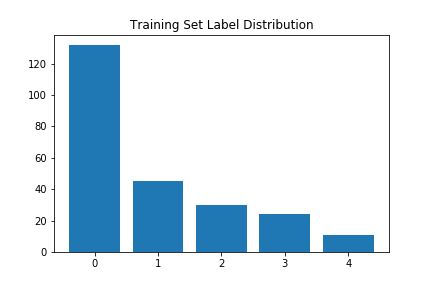 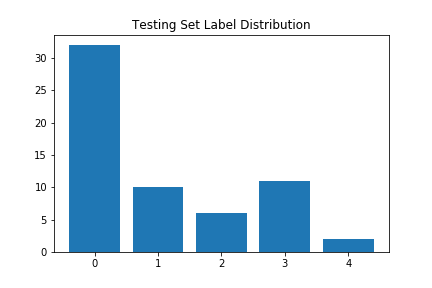

When I first saw these two graphs, I was doubting that the models created by this training set distribution might be good because of the low number of samples for classes 1-4. However, I still went ahead and created some models to prove my doubt. Quickly after training a few models using decision tree and boosting algorithms, it shows that those models are only able to get around .59 accuracy and very low f1 scores where the recalls are close to 0 for classes 1-4. Even with lots of hyperparameters tunning, they are consistently low (below .6 accuracy scores). This indicates that I need to do something to the training set to make it evenly distributed. To do so, I used scikit-learn's `resample()` method which will resample arrays in a consistent way. Using this method, I resampled the samples having classes of 1-4 to be the same as class 0. The result label distribution is now even.

After doing so, the training set size went from around 242 to more than 500 with evenly distributed labels. Now, the dataset is ready for training. 

### **Decision Tree**
Instead of using a custom pruning method, I used the built-in pruning parameters to tune the decision tree classifier for this dataset. Here I am tunning a combination of parameters, including the minimum samples per leaf, the minimum samples per split, a function to measure the quality of a split (gini vs. entropy), and the strategy used to choose the split at each node (random vs. best). 

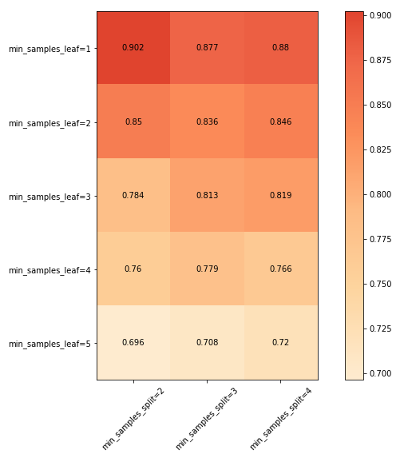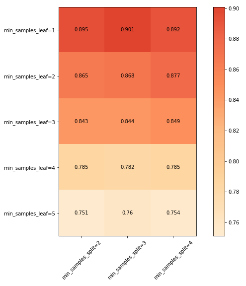

As you can see from these graphs that the best parameters are using the following: `{'criterion': 'gini', 'min_samples_leaf': 1, 'min_samples_split': 2, 'splitter': 'random'}`.

Using this set of parameters, the learning curve from it is the following:

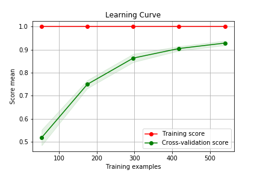

### **Support Vector Machine**
Because of the dataset size, I am able to run more hypterparameters tunning because it is much faster per model training. Here I am tunning a penalty parameter C and gamma which is a kernel coefficient. Here is a graph of that:

As you can see that there is a clear trend towards lower right of the graph. It is able to reach 0.951 cross-validation accuracy at `{'C': 1.0, 'gamma': 0.1}`. The learning curve for it is thw following:

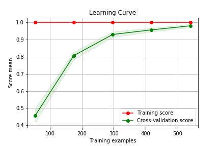

### **KNN**
Here I am tunning the number of neighbors, weights, and a value p which I have described in previous example. The result is this where the first graph is using uniform weights while the second graph uses weights based on distance:

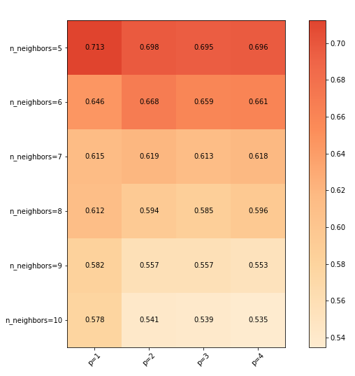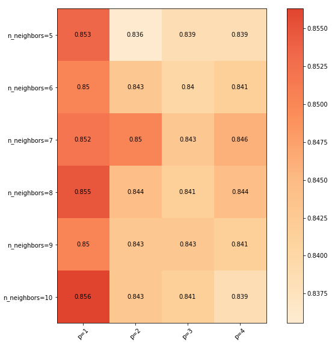

The best model created is using this set of parameters: `{'n_neighbors': 10, 'p': 1, 'weights': 'distance'}`. The learning curve using this is the following:

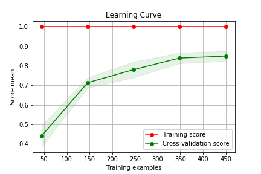

### **Boosting**
Using the same scikit-learn gradient tree boosting method, I am tunning learning rate and number of estimators. 

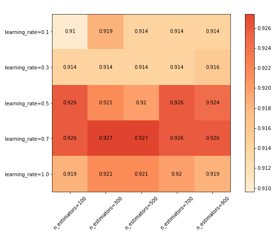

As you can see that the best model created while tunning parameters is using `{'learning_rate': 0.7, 'n_estimators': 300}`. The learning curve for this model is the following:

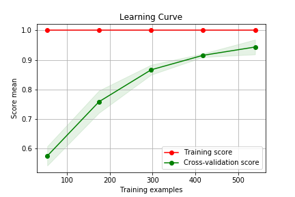

### **Neural Networks**
For this dataset, I am tunning alphas, learning rates, and hidden layer sizes for the `MLPClassifier()`. Here is a graph showing the cross validation hyperparameters tunning result:

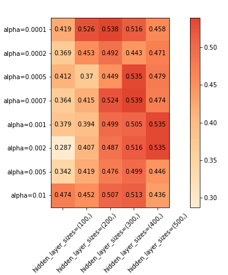

As you can see that the accuracy is low in general with the best model only having 0.538 accuracy. Here is a graph showing the learning curve:

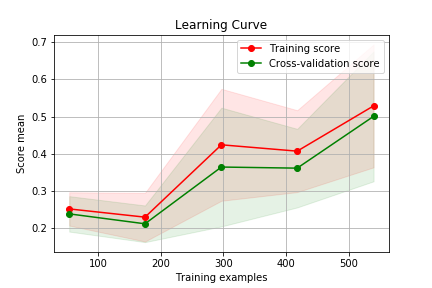

This shows somewhat a reason why I am getting low accuracy scores for MLPClassifer which is the number of training samples is low. As the training sample sizes increase, the scores tend to be better. 

### **Conclusion**
Now I am going to compare the precision, recall as well as f1 scores of the best models from each algorithm because they will provide me useful information in selecting classification algorithm for this dataset. 

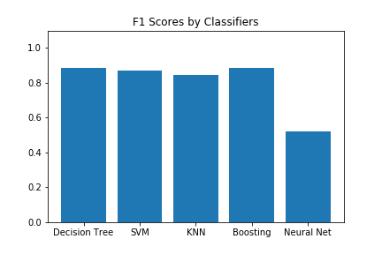

The result shows that the decision tree model has the highest f1 score of 0.9, precision of 0.88 and recall of 0.9. From this experiment, decision tree classifier after tunning can create the best result. 

Now, let's compare training and running times between these classifiers. 

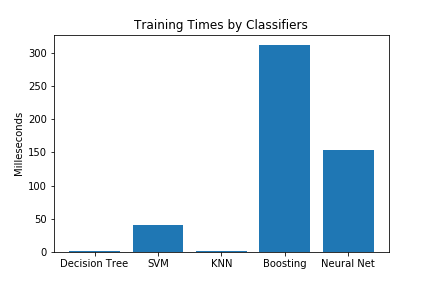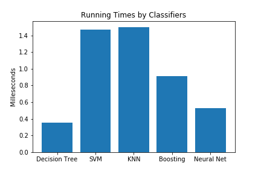 

Based on the graphs above, decision tree and KNN algorithms have the best training times for the best models. An average of 1.52 ms for decision tree and 1.23 for KNN. However, the running time of decision tree model clearly outpace the other algorithms'. Therefore, it depends on how much data is added and how many times the model is being used to determine which model is preferably used. If the dataset is growing siginificantly, and the model needs to be retrained once a period as well as the model usage is low. KNN will have a better choice where the average training time is low. In the contrary, the model being queried more than it is being retrained, a decision tree model is a better choice. 