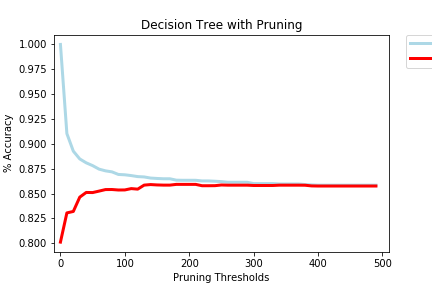
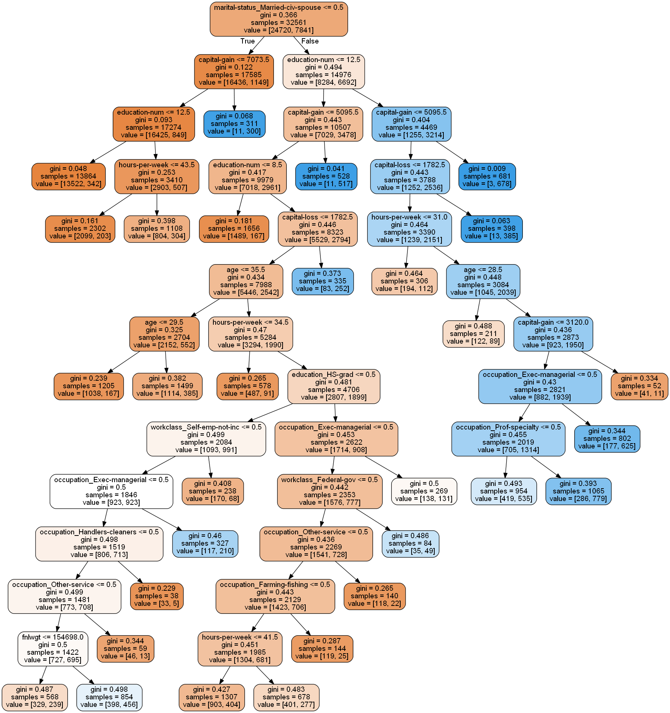
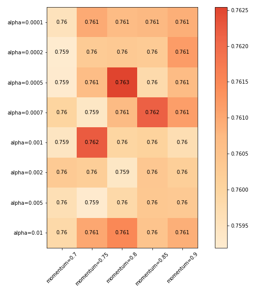
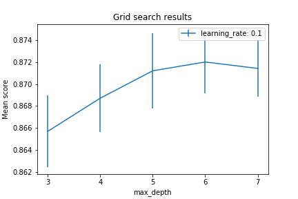
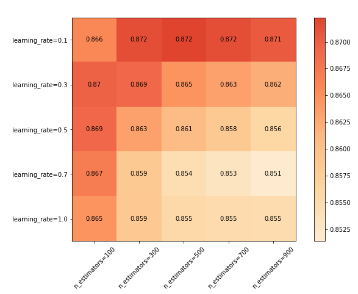

## **Supervised Learning - Report**
#### Xicheng Huang (xhuang343) - Fall 2018

## Table of Content
- [Introduction](#introduction)
- [Dataset One](#dataset-one)
    - [Preprocessing](#preprocessing)
    - [Data Investigation](#data-investigation)
    - [Decision Tree](#decision-tree)
    - [Neural Networks](#neural-networks)
    - [Boosting](#boosting)

## Introduction
For this assignment, I picked two completely different datasets in terms of their characteristics for classification problems so that I can learn applying supervised learning algorithms on a more well-rounded way. The first dataset is somewhat a larger dataset where it consists of more than 48000 records. It is a binary classification problem and the features are categorical. The second dataset I picked is a much smaller dataset with only 304 records, and it is also a multi-class problem. For each dataset, I will explain what I did to preprocess them and then go into each of the supervised learning algorithms I applied and their corresponding performance. 

For this assignment, I primarily used Python's scikit-learn library to perform machine learning tasks and used various libraries, including matplotlib and sklearn-evaluation to graph various performance metrics and results of the applied algorithms. 

## Dataset One
### **Preprocessing**
The first dataset is from UC Irvine Machine Learning Repository, and it is called Adult data set. This is an extraction from the 1994 Census database and prediction task is to determine whether a person makes over 50K a year. Once I loaded the data with headers and the right delimiter, without any preprocessing, the dataset looks like this:

As you can seem the dataset is full of categorical features and the label (incomeCategory) is a string representation as well. Because scikit-learn's classification algorithms will not accept any string representation features, one of the first tasks is to convert them to numerical. I could enumerate the categories for each feature, for example, 0 for "Bachelors" and 1 for "HS-grad" in education, but scikit-learn will treat them as continuous data, as a result, the models could provide wrong "understanding" of these features. So the solution is one-hot-encode all of them. After encoding, it will add extra columns for each category of each of the feature. For example, row 0 will have education_Bachelors as 1, meaning it indeed has a education of Bachelors for the feature, and everything other columns for education is 0. Also, I converted the labels into 0s and 1s where 0 is "<=50K" and 1 is ">50K". Then, there were also a handful missing data, so I just set them as 0. After preprocessing, the dataset looks like this:

### **Data Investigation**
After preprocessing them, I randomly divided the dataset up into thirds, 2/3 will be used for training, and 1/3 will be used to testing. Then, I wanted to check the labels to see if the distribution of classes are even. Here is the result:

 
As you can see, there are far more "<=50K" labels in both the training set and testing set. So to make sure the machine learning models are performant, I should not only look at accuracy score but also f1 scores.

### **Decision Tree**
For decision tree classifier, I used scikit-learn's `DecisionTreeClassifier()` to create the model. Without pruning, the tree has more than 9000 nodes! This is very large and definitely susceptible to overfitting. So I used a custom pruning method to prune the tree after modeling. The custom pruning method takes in a threshold parameter and utilize it to check the value of each node and if the smallest value of the node is below that threshold, it will prune it and its children out. Here is a graph representing the benefit of this pruning process:

As you can see, without any pruning, the model is overfitting there it is at almost 100% accuracy when predicting training set while it is not doing so hot for testing set. As the pruning threshold increases, predictions for training set and testing set are converaging, and overfitting fades out. The final tree looks like this:

Using a model with pruning threshold of 350, I created a f1 score report.

It is pretty good for determining "<=50K" class but not so good at ">50K". Let's look at the what the next algorithm can do.

### **Neural Networks**
For this algorithm, I used `MLPClassifier()`, and specifically, I used logistic regression in combination of stochastic gradient descent for activation because according to the lecture, calculus is better :). I also incorporated k-fold cross-validation and hyperparameter tuning to try to get the best result from this algorithm. For this, I used `GridSearchCV()` provided by scikit-learn. The result is this:

As you can see that the accuracy is around 76.3% and could not get any higher as I tune the parameters. Here is the f1 score result I got from the more accurate model:

Even though the precision for ">50K" is at 1, the recall is at 0, causing f1 score to be very low. Comparatively, the model I was able to produce from neural networks is not as good as the decision tree model above. 

### **Boosting**
Here I am using `GradientBoostingClassifier()` which uses gradient tree boosting, a generalization of boosting to arbitrary differentiable loss functions. There are a number of parameters that I can tune for this classifier, and I am going to focus on the number of estimators, the learning rate, and maximum depth of the gradient decision tree. The graph below shows a fixed learning rate with a variation of numbers of estimators. 

As you can see that the cross validation mean accuracies reaches a peak at 500 estimators. Let's see anothe graph oh maximum depth with fixed learning rate to see if it makes much difference in accuracy.

This shows that the cross-validation accuracy is the highest when the max depth is at 6. Now, let's do a grid search on variations of numbers of estimators and learning rate, setting max depth as 6. 

From the graph, as you can see that the best accuracy I could get is using learning rate of 0.1, number of estimators of 900, with a max depth of 6. Here is a f1 score report of the best model for boosting. 

TODO: f1 report

### **KNN**
Again, I am using scikit-learn's KNN algorithm `KNeighborsClassifier()`. For this method, I am tuning number of neighbors, the weights on the neighbors, and a p value which is power parameter for the Minkowski metric. When p is 1, this is equivalent to using manhattan distance, and euclidean_distance for p is 2. For arbitrary p, minkowski distance is used. The first graph I am showing below is using uniform weights for the nearest neighbors. 

As you can see that the cross validation accuracy is higher then the number of neighbors increases. It also shows that manhattan distance creates better accuracies overall for my dataset. The next graph, I am using the "distance" weights which means the closer neighbors will have higher weights. 

Again, it has similar trends as the last graph's where the accuracy increases as the number of neighbors increases. Also, manhattan distance has beeter accuray. Now, let's have a constant p value and uniform weight. 

From the graph, it shows that the accuracy will peek at 25 neighbors. From this, I ran a f1 score report to see.

### **Support Vector Machine**
Using scikit-learn's SVM classifier, it is pretty slow to train a model running on my machine, which takes on average 70 seconds. Once I added k-fold cross validation, it doesn't finish at all. In their documentation, it says that "the fit time complexity is more than quadratic with the number of samples which makes it hard to scale to dataset with more than a couple of 10000 samples." This dataset has more than 48000 training samples, as a result, I couldn't do much k-fold cross validation and parameters tunning because of the runtime. After creating a SVM model, the f1 score report is the following:

TODO: f1 score report

### **Conclusion**
Now I am going to compare the precision, recall as well as f1 scores of the best models from each algorithm because they will provide me useful information in selecting classification algorithm for this dataset. Keep in mind that the training set label distribution is imbalanced so that f1 score is a better metric than just simply accuracy of the cross-validation.

TODO: comparison charts and explanation

### **Things to Improve** 
There are a number of things I could improve on my analysis. For example, I did not do any feature selection when running these algorithms, and doing so might drastically improve the accuracy as some features might not be significant when training. Also, I could have tried up-sampling or down-sampling to make the label distribution more balanced to create a better training set for creating models. I am doing this for the next dataset though as you will see why. 

## Dataset Two